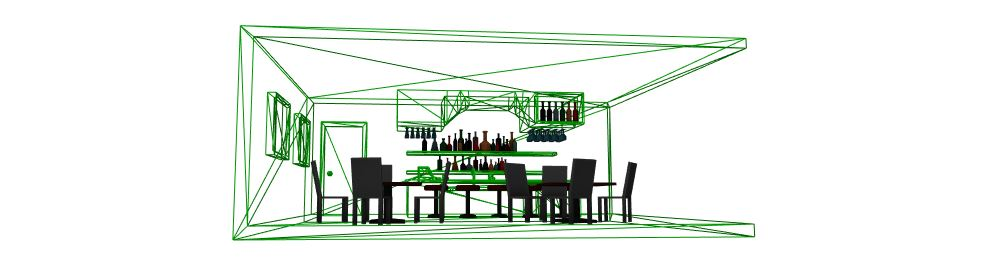

# aframe-materialx-component

**materialx** is a drop-in replacement for the **material** component, which adds the ability to **name** and  **remap** materials. Remapping is useful for changing the materials on imported models. The remap replaces the whole material, it is not possible to change a part of the material.

By default this component applies the material to the object returned by `getObject3D("mesh")` (the standard object used by AFrame).  If **remap** is set then, this material replaces existing materials which have a name matching the **remap** string. **remap** may include special characters `*` or `?`, where `*` which will match any string (even an empty string), and `?` will match any single character (including no character).

`*` - matches any name, including a material without a name

`test*map` - matches *testAABBmap*, *testmap*, *test1map*, but not *TestMap* (incorrect capitilization)

`House?` - matches *House1*, *HouseA*, *House* but fails on *house1* (h when expecting H) or *HouseAA* (two characters after House)

`0.default` - only matches *0.default*

Note: the characters `*` and `?` may be used multiple times, but cannot be matched in a name, use `?` to skip them



This component can appear multiple times on a single entity

e.g.
```html
<a-entity position="0 0 -5" materialx="remap: Bar_A_mat; color: green; wireframe: true" 
  gltf-model="url(bar.gltf)"></a-entity>
```
replaces all materials in this Object3D that have the name `Bar_A_mat` with a green wireframe material

## Properties

**name** : string = ""

defines the name for this material

---
**remap** : string = ""

defines a glob (case sensitive) which matches a name of an existing material in a geometry. For models, the material names can be found by looking inside the model files

---
Includes all the properties of the AFrame **material** component
